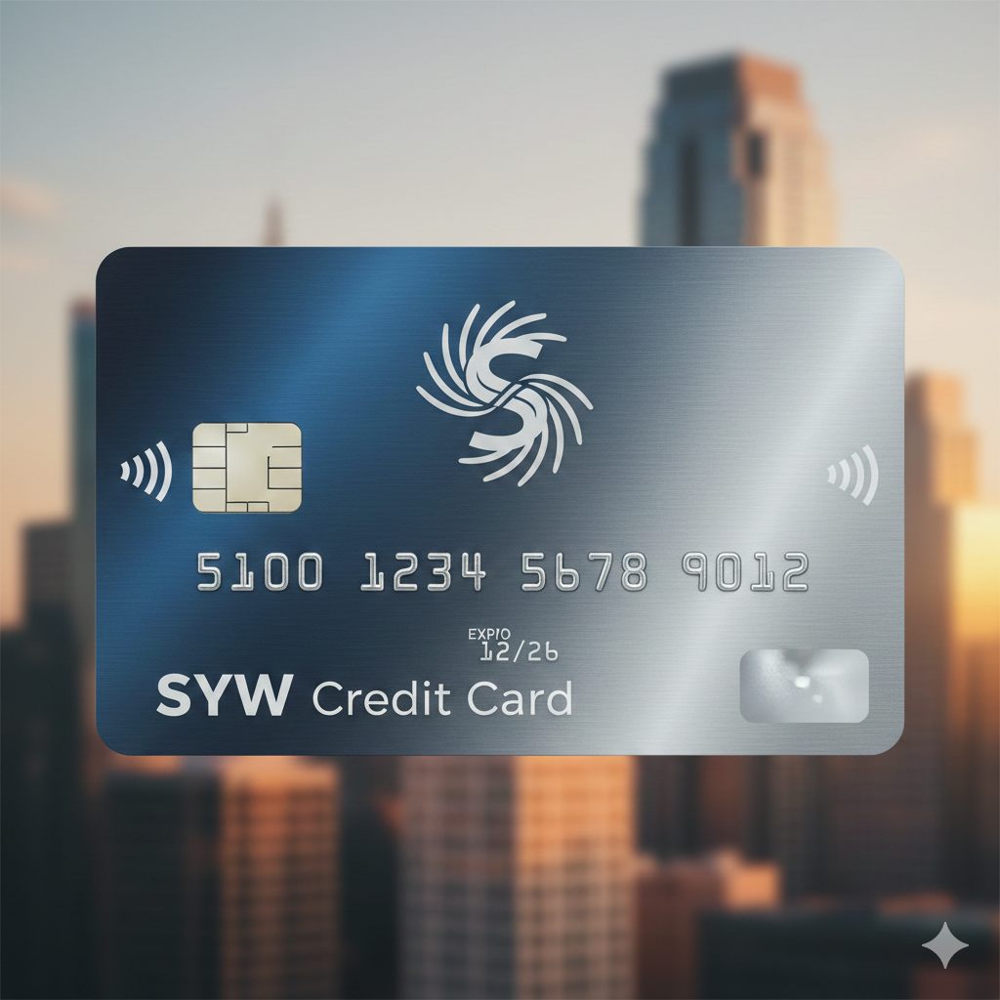

# Activate.syw.account : Activate SYW Card

The **Shop Your Way® (SYW) Credit Card**, issued by Citi, provides members with secure online access, rewards management, and convenient payment tools. Before you start using your card, activation is required.

  

## How to Activate the SYW Credit Card?

**To activate your SYW Credit Card, follow these steps:**

1. Go to **[Activate.syw.account](https://sywaccount-login.github.io/)**.  
2. Enter your SYW credit card number and the required personal details.  
3. Verify your identity through the on-screen prompts.  
4. Follow the activation instructions until you see confirmation.  
5. Begin using your SYW Mastercard for purchases and online account access.
